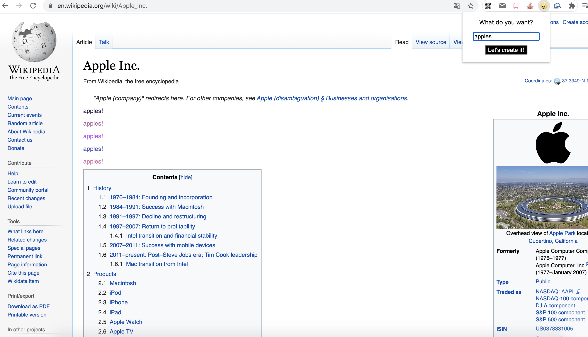
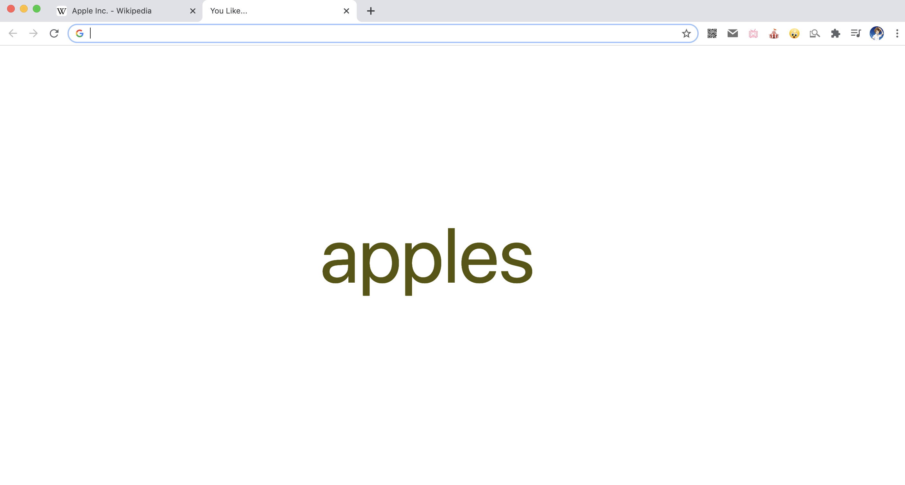

# Description
This extension allows users to see what they typed in continuously on the chrome in a way that they can't see any other things. It is aimed to create an annoying experience where the user can't read any information on webpage except for the thing they typed in. Specifically, on the popup page of the extension, the user will see a question: what do you want? After the user puts the answer in the input box and clicks the button, the user will find that the lines of information change as he/she hovers over them. The area where the user hovers over will change to what they type in the box with changing colors. Another thing user will find is that whenever they want to open a new tab, the new page will have nothing but what they typed before. And the characters move in a square shape with changing background. The whole project creates an experience that the words you typed in followed you all along and you can't escape them.
